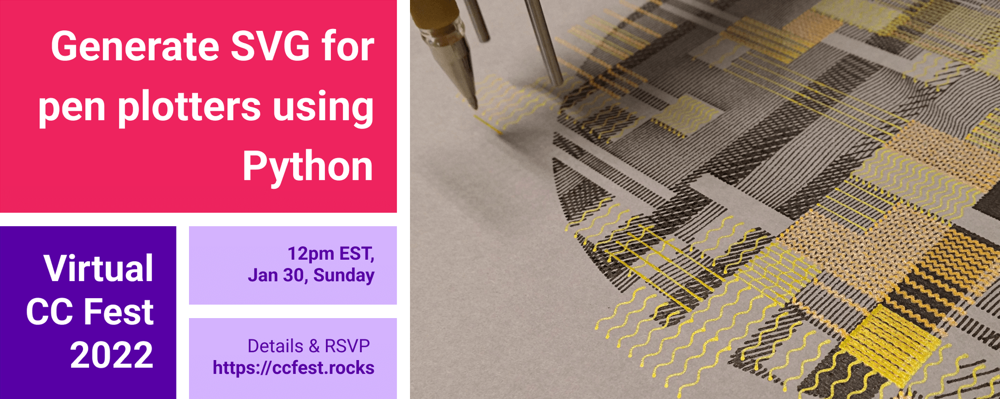

# cc-fest-plotter

*Resources for my Virtual CC Fest 2022 session (Generate SVG for Pen Plotters using Python)*

## Session activities and materials

Here are the **session slides** and **session recording**: [slides.pdf](https://raw.githubusercontent.com/tabreturn/cc-fest-plotter/main/slides.pdf) and [recording.mp4](https://htmlpreview.github.io/?https://raw.githubusercontent.com/tabreturn/cc-fest-plotter/main/recording.html)

Here are the files for each task:

**Task 1: SVG concepts** -- [01-svg_concepts.svg](https://github.com/tabreturn/cc-fest-plotter/blob/main/tasks/01-svg_concepts.svg?short_path=b06e63b)

**Task 2: py5 SVG** -- [02-py5_svg.py](https://github.com/tabreturn/cc-fest-plotter/blob/main/tasks/02-py5_svg.py)

**Task 3: Blender SVG** -- [03-blender_svg.py](https://github.com/tabreturn/cc-fest-plotter/blob/main/tasks/03-blender_svg.py)

**Task 4: Codeless SVG** -- [04-codeless_svg.md](https://github.com/tabreturn/cc-fest-plotter/blob/main/tasks/04-codeless_svg.md?plain=1)

## py5 resources

"py5 is a new version of Processing for Python 3.8+. It makes the Java Processing jars available to the CPython interpreter using JPype. It can do just about everything Processing can do, except with Python instead of Java code."

* [py5 documentation](http://py5.ixora.io/)
* [py5 examples](https://github.com/hx2A/py5examples)
* [py5 discussions/forum](https://github.com/hx2A/py5generator/discussions)
* [thonny-py5mode plug-in](https://github.com/tabreturn/thonny-py5mode)
* [py5 cheatsheet](https://raw.githubusercontent.com/tabreturn/processing.py-cheat-sheet/master/py5/py5_cc.pdf)

The [Processing forum](https://discourse.processing.org/c/processing-py/9) is also great for help with anything Processing + Python related.

## Useful plotter utilities

A handy (but hardly complete) list of useful software for working with plotter art files:

* [Beardicus' Awesome Plotters list](https://github.com/beardicus/awesome-plotters) -- a curated list of code and resources for computer-controlled drawing machines and other visual art robots
* [Msurguy's 3d-engines-for-plotters list](https://github.com/msurguy/awesome-3d-engines-for-plotters) -- links to awesome 3D SVG exporters
* [occult](https://github.com/LoicGoulefert/occult) -- vpype plug-in to remove lines occulted by polygons from SVG files
* [plotter.vision](https://plotter.vision/) -- upload 3D STL files, interactively position them, then render them as SVG
* [Processing Geometry Suite](https://github.com/micycle1/PGS) -- a software project that provides easy access to 2D geometric algorithms in the form of a Processing library
* [UJI](https://doersino.github.io/uji/) -- a minimalist generative art thing; press the buttons and play with the sliders
* [vpype](https://github.com/abey79/vpype) -- the Swiss-Army-knife command-line tool for plotter vector graphics
* [vsketch](https://github.com/abey79/vsketch) -- a Python generative art toolkit for plotters

I recommend exploring [drawingbots.net](https://drawingbots.net/), which is on a mission "to become the central place on the web to discover the world of drawing robots, get inspiration, and talk to other drawing robot enthusiasts."

## Inspiration

A few (of the many) artists creating inspiring plotter art --

[Antoine Beyeler](https://github.com/abey79/sketches) · [Binaura](https://www.binaura.net/) · [Gábor Ugray](https://jealousmarkup.xyz/plots/) · [Iskra Velitchkova](http://iskraovelitchkova.com/works.html) · [Jakob Glock](https://github.com/JakobGlock/Generative-Art) · [Julien Espagnon](https://www.instagram.com/julien_espagnon/) · [Julien Gachadoat](http://www.v3ga.net/) · [Matthis Grunsky](https://www.matthisgrunsky.ca/) · [Michael Fogleman](https://www.michaelfogleman.com/plotter/) · [Sean Puckett](https://plotterprints.square.site/s/shop) · [Sohan Murthy](https://sohan.space/) · [thedotisblack](https://thedotisblack.com/)

The [Anne and Michael Spalter Digital Art Collection](https://spalterdigital.com/) includes plotter artwork from several groundbreaking artists (Vera Molnar, Frieder Nake, Georg Nees, ...)

Also, check Twitter for [#plottertwitter](https://twitter.com/search?q=%2523plottertwitter), [#py5](https://twitter.com/search?q=%2523plottertwitter), and [#generativeart + #blender](https://twitter.com/search?q=%2523generativeart%20%2523blender).

## Other useful resources

Other useful plotter and Python creative coding resources:

* [Villares' comprehensive list of resources](https://github.com/villares/Resources-for-teaching-programming#user-content-processing--python-tools-table) for teaching programming for artists, designers, and architects

* [PlotterFiles](https://plotterfiles.com/) hosts free SVG files for plotters and drawing robots

[Learn Python Visually](https://nostarch.com/Learn-Python-Visually) is a book based on [Processing.py](https://py.processing.org/), but it should be relatively straight-forward adapting the content for py5. Everything `camelCase` switches to `snake_case` -- so, `colorMode()` becomes `color_mode()`, and so forth. I ~~plan~~ hope to adapt the book for py5 in 2022.

* Learn Python Visually [GitHub repository](https://github.com/tabreturn/processing.py-book) for the book's official resources and code, as well as solutions to challenges.
